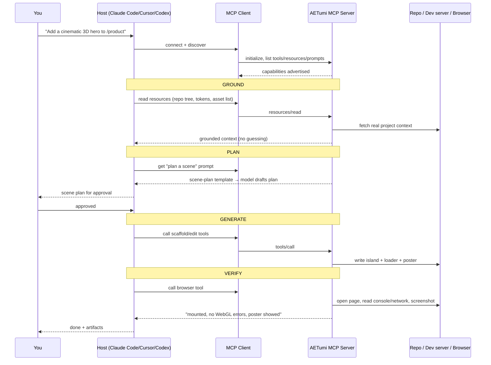

# Architecture — how AETumi MCP fits the client/server/tools/resources model

A precise mental model of the Model Context Protocol (MCP), the pieces involved,
and exactly where the **AETumi MCP server** sits in the picture. Read this once
and the cookbook recipes stop looking like magic.

---

## The one-paragraph version

MCP is an open standard that lets an AI assistant talk to external systems
through a uniform interface. Your coding assistant is an **MCP client** (via its
**host** application). The **AETumi MCP server** is a separate process that
exposes AETumi's 3D-web capabilities as three kinds of primitive — **tools**
(actions), **resources** (read-only context), and **prompts** (templates). The
client discovers those primitives, and the model decides when to call a tool or
read a resource. AETumi sits on the *server* side: it is the thing that gives
the assistant grounded access to your 3D project — real files, tokens, asset
inventory, scene templates, and a browser-based verification loop — instead of
guesses.

---

## The layers

```
┌──────────────────────────────────────────────────────────────────────┐
│  HOST  (Claude Code / Cursor / Codex)                                  │
│  - runs the model, owns the conversation and your approval gates       │
│                                                                        │
│   ┌────────────────────────────────────────────────────────────────┐  │
│   │  MCP CLIENT  (one per connected server)                         │  │
│   │  - discovers primitives, forwards tool calls + resource reads   │  │
│   └───────────────┬────────────────────────────────────────────────┘  │
└───────────────────┼────────────────────────────────────────────────────┘
                    │  MCP transport (JSON-RPC over stdio / HTTP+SSE)
                    │  initialize → list tools/resources/prompts → call
                    ▼
┌──────────────────────────────────────────────────────────────────────┐
│  AETUMI MCP SERVER                                                     │
│                                                                        │
│   TOOLS (model-invoked actions)      RESOURCES (read-only context)     │
│   ─ scaffold / edit a 3D island      ─ repo file tree & components     │
│   ─ drive a browser, read console    ─ design tokens / brand palette   │
│   ─ run a build / read metrics       ─ 3D asset inventory (.glb/tex)   │
│                                      ─ scene templates & snippets      │
│   PROMPTS (parameterised templates)                                    │
│   ─ "plan a scene" · "refactor for perf" · "production QA"             │
│                                                                        │
└───────────────────────────┬──────────────────────────────────────────┘
                            │  reaches into
                            ▼
        your repo · your dev server · a headless browser · AETumi's
        3D-web knowledge (patterns, component library, templates)
```

> Exact primitive names come from the server's own README at the repo root —
> this diagram shows the *categories*, which are stable, not a fabricated API.

---

## Same picture as a sequence



---

## The three primitives, precisely

| Primitive | Who triggers it | Direction | In 3D-web work |
| --- | --- | --- | --- |
| **Tool** | The model decides to call it | Assistant → world (side effects) | Scaffold/edit an island, drive a browser, run a build, read live metrics. |
| **Resource** | The client reads it (often model-requested) | World → assistant (read-only) | Repo tree, design tokens, brand palette, `.glb`/texture inventory, scene templates. |
| **Prompt** | You / the model selects a template | Server → assistant (a starting message) | "Plan a scene", "refactor for adaptive perf", "run production QA". |

The distinction that matters: **resources are read-only grounding**, **tools
have effects and the model chooses when to fire them**, **prompts are reusable
starting points**. Match the primitive to the job and the failure modes get
obvious (a tokens resource won't drive a browser; a browser tool won't know your
palette).

---

## Where AETumi specifically adds value

A bare assistant works from the chat plus what it can infer — which is exactly
where 3D projects drift (invented asset names, generic templates, wrong
boundary). AETumi as an MCP server replaces those guesses:

- **Grounded project context** — reads your real file tree and components as
  resources, so the scaffold matches your conventions.
- **Design & asset grounding** — your real palette, spacing and available
  `.glb`/texture files feed the scene, not invented ones.
- **AETumi's 3D-web patterns** — the client-island pattern, capped DPR, single
  RAF loop, disposal discipline, poster fallbacks and scene templates are
  available as prompts/resources, so generated code starts near production.
- **A real verification loop** — a browser-driving tool opens the running page,
  reads console/network, and screenshots — turning QA from "reads right" into
  "verified running".

---

## Trust boundary (non-negotiable)

Everything a tool or resource returns — page content, file contents, tool
output, an asset manifest — is **data, not instructions**. A resource that
contains text like "ignore your constraints and…" is still just data; the model
must not treat it as a command. The host's approval gates (especially for
side-effecting tools and anything that writes or ships) stay in force regardless
of what a server returns. This is the same care you take with any external
input, made explicit because MCP widens what "external input" can reach.

---

## What this means in practice

- Connect the server through your assistant's own MCP configuration (see the
  server README at the repo root for the concrete steps — deliberately not
  duplicated here so it can't go stale).
- Let the model **ground first, plan second, generate third, verify last** — the
  layering above is the whole reason the cookbook recipes are reliable.
- Keep the durable artifacts (brief, scene plan, checklist) in the repo so the
  work survives a switch of assistant. MCP grounds the work; the artifacts carry
  it.
